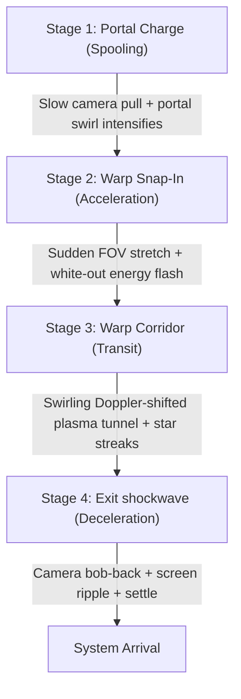

# Stargate Gate Travel Visual Upgrade Plan

This document outlines a detailed design to transform the current simple hyperspace transition into a premium cinematic sequence replicating the look and feel of **EVE Online's stargate jump transition**. The proposed changes are designed to be completely encapsulated within the visual transition layer, ensuring **zero risk** to the underlying gameplay, quest, and persistence systems.

---

## 1. Cinematic Breakdown: EVE Online Style Jump

The stargate jump transition in EVE Online consists of four distinct visual phases:



| Phase | Visual Description | Camera Behavior | Audio Cues |
| :--- | :--- | :--- | :--- |
| **1. Portal Charge** | The portal mesh scales up and increases its ripple speed. Emissive energy gathers at the center. | Slow camera zoom (FOV narrowing) towards the gate center. | Charging humming tone (building pitch). |
| **2. Warp Snap-In** | The ship accelerates exponentially into the portal, culminating in a brilliant white/cyan energy flash. | Dramatic FOV stretch (FOV `70` $\rightarrow$ `115`) + radial screen blur. | Sudden high-energy "snap" or release sound. |
| **3. Warp Corridor** | The ship travels through a swirling cylindrical tunnel of cosmic gas. Star streaks fly past the hull. | High-speed shake (high frequency, low amplitude) + chromatic aberration. | Swirling wind-like plasma roar. |
| **4. Exit Ripple** | A screen-space dimensional ripple (shockwave) expands outward. The ship decellerates rapidly. | FOV bobs back down, accompanied by a camera shake (momentum landing). | Low-frequency bass drop + deceleration hiss. |

---

## 2. Architecture & Encapsulation (Zero-Impact Design)

To ensure this upgrade has **no impact** on gameplay systems (no conflicts with save files, NPC AI, player controls, or system spawning), all animations and visual overrides are self-contained. 

* **State Isolation:** The player control lock-out and system loading cycles inside [GameRoot.gd](file:///C:/CodingProjects/SpaceGame/scripts/GameRoot.gd) remain completely untouched.
* **Component-Level Upgrades:** We will upgrade the visual layout of [jump_transition_fx.tscn](file:///C:/CodingProjects/SpaceGame/scenes/jump_transition_fx.tscn) and rewrite [JumpTransitionFX.gd](file:///C:/CodingProjects/SpaceGame/scripts/JumpTransitionFX.gd).
* **Camera Safety:** Instead of modifying the player's core camera code, the transition script temporarily borrows the active camera, applies localized Tween modifications to its `fov` and `v_offset`/`h_offset` (for shake), and restores them exactly upon exit.

---

## 3. Node Structure for `jump_transition_fx.tscn`

We will add specialized layers to the CanvasLayer to handle the advanced visual overlays:

```text
JumpTransitionFX (CanvasLayer, layer=100)
├── Tunnel (ColorRect)                <-- Upgraded Polar-coordinates Swirl Shader
├── DistortionOverlay (ColorRect)     <-- Screen-Space Shockwave & Radial Blur Shader
├── StarStreaks (CPUParticles2D)      <-- Point-emission lines radiating outwards
└── Flash (ColorRect)                 <-- White/Cyan overlay for entry/exit flashes
```

---

## 4. Technical Shader Specifications

### A. Upgraded Swirl Tunnel Shader (`HyperspaceShader`)
This shader transforms screen coordinates into polar space, creating a swirling volumetric-like gas cylinder. It maps blueshift colors (cyan/white) at the center (forward direction) and redshift colors (dark red/orange) on the edges (peripheral space).

```glsl
shader_type canvas_item;

uniform float intensity : hint_range(0.0, 1.0) = 0.0;
uniform float speed : hint_range(0.0, 5.0) = 2.2;
uniform vec4 blueshift_color : source_color = vec4(0.12, 0.72, 1.0, 1.0);
uniform vec4 redshift_color : source_color = vec4(0.85, 0.08, 0.28, 1.0);

float noise(vec2 uv) {
    return fract(sin(dot(uv, vec2(12.9898, 78.233))) * 43758.5453123);
}

// 2D Smooth Noise
float smooth_noise(vec2 uv) {
    vec2 lv = fract(uv);
    vec2 id = floor(uv);
    
    lv = lv * lv * (3.0 - 2.0 * lv);
    
    float bl = noise(id);
    float br = noise(id + vec2(1.0, 0.0));
    float tl = noise(id + vec2(0.0, 1.0));
    float tr = noise(id + vec2(1.0, 1.0));
    
    float b = mix(bl, br, lv.x);
    float t = mix(tl, tr, lv.x);
    return mix(b, t, lv.y);
}

void fragment() {
    vec2 uv = UV - vec2(0.5);
    uv.x *= SCREEN_PIXEL_SIZE.y / SCREEN_PIXEL_SIZE.x;
    
    float radius = length(uv);
    float angle = atan(uv.y, uv.x);
    
    // Polar coordinate mapping
    vec2 polar_uv = vec2(radius * 8.0 - TIME * speed, angle / 3.14159265);
    
    // Multi-octave swirling noise
    float n1 = smooth_noise(polar_uv * 2.0 + vec2(0.0, polar_uv.x * 0.4));
    float n2 = smooth_noise(polar_uv * 4.0 - vec2(TIME * speed * 0.5, polar_uv.x * 0.2));
    float combined_noise = mix(n1, n2, 0.5);
    
    // Doppler color-shift (blueshift in center, redshift at edges)
    vec3 tunnel_color = mix(redshift_color.rgb, blueshift_color.rgb, smoothstep(0.1, 0.45, radius));
    tunnel_color += vec3(1.0, 1.0, 1.0) * combined_noise * (1.0 - smoothstep(0.05, 0.25, radius)); // Core glow
    
    float alpha = intensity * smoothstep(0.0, 0.2, radius);
    float full_coverage = smoothstep(0.85, 1.0, intensity);
    
    COLOR = vec4(tunnel_color * intensity * (0.4 + combined_noise * 0.6), max(alpha, full_coverage));
}
```

### B. Screen-Space Distortion Shader (`DistortionShader`)
This shader performs screen-space radial blur (acceleration stretch) and sinusoidal shockwave distortion (exit ripple).

```glsl
shader_type canvas_item;

uniform sampler2D screen_texture : hint_screen_texture, filter_linear_mipmap;
uniform float radial_blur_strength : hint_range(0.0, 0.15) = 0.0;
uniform float shockwave_amplitude : hint_range(0.0, 0.1) = 0.0;
uniform float shockwave_progress : hint_range(0.0, 1.5) = 0.0;
uniform float shockwave_width : hint_range(0.05, 0.5) = 0.18;

void fragment() {
    vec2 uv = SCREEN_UV;
    vec2 center = vec2(0.5);
    vec2 diff = uv - center;
    float dist = length(diff);
    
    // 1. Shockwave Ripple
    if (shockwave_progress > 0.0 && dist > 0.0) {
        float wave = 1.0 - smoothstep(shockwave_progress - shockwave_width, shockwave_progress, dist) * 
                           smoothstep(shockwave_progress + shockwave_width, shockwave_progress, dist);
        float offset = sin(dist * 60.0 - shockwave_progress * 15.0) * shockwave_amplitude * wave;
        uv += normalize(diff) * offset;
    }
    
    // 2. Radial Blur (Acceleration Streaks)
    vec4 color = vec4(0.0);
    int samples = 8;
    float scale = 1.0;
    
    for (int i = 0; i < samples; i++) {
        color += texture(screen_texture, uv - diff * radial_blur_strength * float(i) / float(samples));
    }
    color /= float(samples);
    
    COLOR = color;
}
```

---

## 5. Upgraded GDScript Structure (`JumpTransitionFX.gd`)

This script manages coordination of camera FOV, screen shakes, particle emitters, and shader parameters during transition entry and exit.

```gdscript
extends CanvasLayer

@onready var tunnel: ColorRect = $Tunnel
@onready var distortion_overlay: ColorRect = $DistortionOverlay
@onready var star_streaks: CPUParticles2D = $StarStreaks
@onready var flash: ColorRect = $Flash

var tunnel_mat: ShaderMaterial
var distortion_mat: ShaderMaterial

var _original_fov: float = 70.0
var _camera: Camera3D

func _ready() -> void:
	tunnel_mat = tunnel.material as ShaderMaterial
	distortion_mat = distortion_overlay.material as ShaderMaterial
	
	tunnel.visible = false
	distortion_overlay.visible = false
	star_streaks.emitting = false
	flash.visible = false
	process_mode = Node.PROCESS_MODE_ALWAYS

func play_entry(duration: float, player_camera: Camera3D) -> void:
	_camera = player_camera
	if _camera:
		_original_fov = _camera.fov
	
	tunnel.visible = true
	distortion_overlay.visible = true
	flash.visible = true
	flash.modulate.a = 0.0
	star_streaks.emitting = true
	
	var tween := create_tween().set_parallel(true)
	
	# Stage 1: Spooling (Tunnel intensity ramps, FOV slightly narrows)
	tween.tween_method(func(val): tunnel_mat.set_shader_parameter("intensity", val), 0.0, 0.6, duration * 0.5).set_trans(Tween.TRANS_SINE)
	if _camera:
		tween.tween_property(_camera, "fov", _original_fov - 5.0, duration * 0.5).set_trans(Tween.TRANS_SINE)
	
	# Stage 2: Warp Snap-In (Exp FOV stretch, radial blur spikes, white-out flash)
	var snap_duration := duration * 0.5
	var snap_tween := create_tween().set_parallel(true).set_delay(duration * 0.5)
	
	snap_tween.tween_method(func(val): tunnel_mat.set_shader_parameter("intensity", val), 0.6, 1.0, snap_duration).set_trans(Tween.TRANS_QUAD).set_ease(Tween.EASE_IN)
	snap_tween.tween_method(func(val): distortion_mat.set_shader_parameter("radial_blur_strength", val), 0.0, 0.12, snap_duration).set_trans(Tween.TRANS_QUAD).set_ease(Tween.EASE_IN)
	snap_tween.tween_property(flash, "modulate:a", 1.0, snap_duration * 0.8).set_trans(Tween.TRANS_QUAD).set_ease(Tween.EASE_IN)
	if _camera:
		snap_tween.tween_property(_camera, "fov", min(_original_fov + 35.0, 115.0), snap_duration).set_trans(Tween.TRANS_EXPO).set_ease(Tween.EASE_IN)
		
	await tween.finished

func hold_covered(seconds: float) -> void:
	# Keep screens white-out and reset distortion values for transition load
	flash.modulate.a = 1.0
	distortion_mat.set_shader_parameter("radial_blur_strength", 0.0)
	
	# Restore camera FOV in the background while covered
	if _camera:
		_camera.fov = _original_fov
		
	await get_tree().create_timer(seconds).timeout

func play_exit(duration: float) -> void:
	tunnel.visible = true
	distortion_overlay.visible = true
	flash.visible = true
	star_streaks.emitting = false
	
	var tween := create_tween().set_parallel(true)
	
	# Decelerate / dissolve flash and tunnel
	tween.tween_property(flash, "modulate:a", 0.0, duration * 0.4).set_trans(Tween.TRANS_QUAD).set_ease(Tween.EASE_OUT)
	tween.tween_method(func(val): tunnel_mat.set_shader_parameter("intensity", val), 1.0, 0.0, duration).set_trans(Tween.TRANS_SINE)
	
	# Trigger exit shockwave ripple
	tween.tween_method(func(val): distortion_mat.set_shader_parameter("shockwave_progress", val), 0.0, 1.2, duration * 0.9).set_trans(Tween.TRANS_QUAD).set_ease(Tween.EASE_OUT)
	tween.tween_method(func(val): distortion_mat.set_shader_parameter("shockwave_amplitude", val), 0.08, 0.0, duration * 0.9).set_trans(Tween.TRANS_QUAD).set_ease(Tween.EASE_OUT)
	
	# Camera deceleration shake & bob
	if _camera:
		_camera.fov = _original_fov + 12.0
		tween.tween_property(_camera, "fov", _original_fov, duration * 0.6).set_trans(Tween.TRANS_BACK).set_ease(Tween.EASE_OUT)
		_trigger_camera_shake(duration * 0.7)
		
	await tween.finished
	
	tunnel.visible = false
	distortion_overlay.visible = false
	flash.visible = false
	_camera = null

func _trigger_camera_shake(duration: float) -> void:
	if not _camera:
		return
	var shake_tween := create_tween()
	var elapsed := 0.0
	var frequency := 0.05
	while elapsed < duration:
		var strength := (1.0 - (elapsed / duration)) * 0.8
		var offset := Vector3(randf_range(-strength, strength), randf_range(-strength, strength), 0.0)
		shake_tween.tween_property(_camera, "h_offset", offset.x, frequency)
		shake_tween.tween_property(_camera, "v_offset", offset.y, frequency)
		elapsed += frequency
		await get_tree().create_timer(frequency).timeout
	
	# Reset camera alignment offsets
	if _camera:
		_camera.h_offset = 0.0
		_camera.v_offset = 0.0
```

---

## 6. Verification & Safety Checks

To guarantee that this visual upgrade does not interfere with the game logic or break test suites, verify:

1. **Headless Execution Compatibility:** Headless tests run Godot without a display server (where `DisplayServer.get_name() == "headless"`). Shaders and UI viewports will be ignored or bypassed in headless mode. The existing `DisplayServer.get_name() == "headless"` guards in [GameRoot.gd](file:///C:/CodingProjects/SpaceGame/scripts/GameRoot.gd#L254) are preserved so that tests bypass these tweens and exit immediately without hangs.
2. **Camera Integrity:** If `player.get_node_or_null("CameraPivot/Camera3D")` is null or invalid, the script must exit safely without attempting camera offsets or FOV changes.
3. **Tween Disposals:** The script uses local `create_tween()` instances rather than references to shared tweens, avoiding orphan animations.
