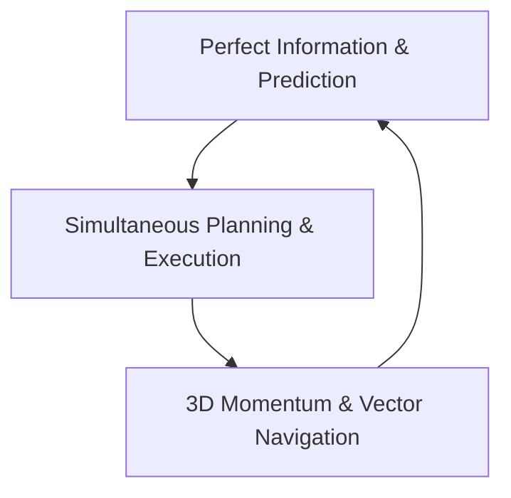

# Vector Tactical System (VTS) — Turn-Based Space Combat Design
_Date: 2026-06-24 | Reference: turn-based space combat transition planning_


This document outlines the design for transitioning **SpaceGame** from a real-time point-and-click flight model to a hybrid **WEGO (Simultaneous Turn-Based)** tactical system. It preserves the 3D physics and visual flair of space flight while introducing deep, deterministic strategy, directional shield routing, advanced evasive dodges, and tactical drone deployments.

---

## 1. Core Philosophy: The Golden Triangle of Space Tactics
Instead of traditional turn-based combat where units stand still and take turns shooting, the **Vector Tactical System (VTS)** is built on three pillars:



1. **Perfect Information & Prediction (Inspired by *Into the Breach*)**:
   - The player's tactical interface displays the exact path and target arcs the enemy intends to execute over the next turn. Combat is a strategic puzzle of negation, positioning, and counter-tactics rather than a roll of the dice.
2. **Simultaneous Planning & Execution (Inspired by *Phantom Brigade* & *Frozen Synapse*)**:
   - The player and AI plan their turns concurrently during a paused **Planning Phase**.
   - Once committed, time resumes for a 5-second **Execution Phase** where actions resolve dynamically in real-time, followed by the next planning turn.
3. **3D Momentum & Vector Navigation**:
   - Space flight relies on inertia and vectors. Upgraded engines allow tighter turning arcs, faster acceleration, and more elaborate evasive maneuvers, while cargo weight limits movement flexibility.

---

## 2. The Combat Loop

A battle transition occurs seamlessly when the player ship enters an aggressive NPC’s engagement radius (e.g., 450m) or fires first. 

```
[Real-Time Exploration] 
       │ (Engagement)
       ▼
┌────────────────────────────────────────────────────────┐
│ 1. PLANNING PHASE (Time Paused)                       │
│    - Enemy intents/paths displayed on 3D HUD          │
│    - Player spends Power Pool (AP) to plot:            │
│      * Movement Vector Ribbon                         │
│      * Weapon Firing Timelines                        │
│      * Evasive Maneuvers (Dodges, Stalls)             │
│      * Shield Power Routing & Deflectors              │
│      * Drone Deployments                              │
└───────────────────────┬────────────────────────────────┘
                        │ (Execute Command)
                        ▼
┌────────────────────────────────────────────────────────┐
│ 2. RESOLUTION PHASE (5-Second Cinematic Playback)      │
│    - Time resumes at normal speed                      │
│    - Ships fly, dodge, fire, and deploy drones         │
│    - Physics and collision calculations resolve       │
│    - Dynamic camera angles capture the action         │
└───────────────────────┬────────────────────────────────┘
                        │
                        ▼
           [Check Combatants Defeated?]
             ├── Yes ──> [Return to Real-Time Exploration]
             └── No  ───> [Next Planning Phase]
```

---

## 3. Movement and Vector Planning

In the planning phase, navigation uses the 3D mouse raycast to plot a **Movement Vector Ribbon** representing the path the ship will fly during the 5-second execution phase.

```
       [Target Path] ────> ───★───★───★───★───★ (Timeline Nodes)
     /
[Player Ship] ─── (Evasive Barrel Roll) ───> [New Vector]
```

### Vector Limitations
- **Turn Radius & Drift**: Ships cannot change direction instantly. Heavy cargo vessels (high mass) experience massive drift, meaning their planned ribbon will slide outward during turns. Upgraded Engines reduce drift and allow sharper turning angles.
- **Engine Charge**: Plotting a longer path draws more engine power, consuming part of the player's turn-based Action Point (AP) pool.
- **Collision Obstacles**: Asteroids, stations, and debris block flight paths. Flying through them results in immediate hull damage unless autopilot safety overrides are engaged or micro-warp maneuvers are used.

---

## 4. Evasive Maneuvers (Attack Dodges)

To make combat engaging, players can inject special **Evasive Maneuvers** directly into their planned movement ribbon. These actions consume Engine Charge and AP, but break enemy targeting and negate incoming fire.

| Maneuver | AP Cost | Mechanic | Tactical Use |
| :--- | :--- | :--- | :--- |
| **Barrel Roll** | 2 AP | Shifts the ship laterally (Left/Right) by 15 meters over 1.2s. | Breaks tracking locks and slides the ship out of linear projectile paths. |
| **Micro-Warp Jump** | 4 AP | Teleports the ship 40 meters forward instantly. Disables shields for 1.0s post-teleport. | Teleports past an asteroid or through a wall of missiles. |
| **Reverse Thruster Stall** | 1 AP | Temporarily halts forward momentum for 1.0s while keeping orientation. | Forces an tailgating enemy ship to overshoot, placing them in your firing arc. |
| **Chaff Decoy Flare** | 2 AP | Launches a heat flare at a specific node on the movement timeline. | Draws homing missiles and defensive drone fire away from the player ship for 2.0s. |

---

## 5. Directional Shield Routing & Deflectors

Rather than a simple health pool, the ship's shields are split into **four directional quadrants** (Front, Port, Starboard, Aft) shown on a tactical hologram interface.

```
          ▲ Front (150%)
          │
  Port ◄──┼──► Starboard (50%)
 (100%)   │
          ▼ Aft (100%)
```

### Core Shield Actions
1. **Dynamic Shield Shifting**:
   - During the planning phase, the player can drag energy sliders to route power between quadrants.
   - *Example*: If the predictive radar shows the enemy targeting the ship's rear, the player can route 100% of side shields to the Aft, leaving the sides vulnerable but creating an impenetrable wall at the back.
2. **Active Deflector Pulse (Timed Deflection)**:
   - Costs 2 AP. The player schedules a 0.75-second **Deflector Pulse** on a specific quadrant at a precise second of the execution timeline.
   - If an enemy laser or projectile hits that quadrant during the pulse window, the damage is completely absorbed and **reflected back at the source** or converted into **Power Pool (AP)** for the next turn.

---

## 6. Drone Support Network (Attack Dogs / Doves)

Ships can be equipped with a **Drone Bay** component, allowing them to launch and coordinate autonomous drone swarms. Drones take actions concurrently during the execution phase.

```
                   ┌───> [Interceptor Drone] ───> Harrasses Enemy Shields
                   │
[Player Ship] ─────┼───> [Shield Projector] ───> Deploys Mobile Cover Point
                   │
                   └───> [Siphon Drone] ───────> Drains AP from target
```

### Drone Archetypes

*   **Sentinel Drones ("Attack Dogs")**:
    *   **Behavior**: Swarm targeted enemy ships, firing high-cadence, low-damage lasers.
    *   **Tactical Purpose**: They deal minimal damage to hull but constantly hit shields, preventing the enemy's shield recharge delay from kicking in.
*   **Shield Projector Drones ("Doves")**:
    *   **Behavior**: Deploy to a designated spatial coordinate in the planning phase and anchor there.
    *   **Tactical Purpose**: They project a flat energy wall in 3D space. The player can fly behind this wall to block enemy direct-fire lines, creating temporary cover in open space.
*   **Energy Siphon Drones**:
    *   **Behavior**: Fire a tether beam at an enemy ship, maintaining connection if they stay within 100 meters.
    *   **Tactical Purpose**: Siphons power from the enemy, reducing their available AP pool next turn while granting the player +1 bonus AP.

---

## 7. Component Targeting (Tactical Sabotage)

Weapons are no longer fired blindly. During the planning phase, players lock their weapon fire cones onto specific subsystems of the enemy ship:

*   **Target Weapons**: Damage reduces the enemy's attack range or disables their primary guns for subsequent turns.
*   **Target Engines**: Reduces the enemy's movement range (max vector ribbon length) and reduces their **Initiative** score.
*   **Target Shield Generator**: Disables their shield regeneration ability entirely.
*   **Target Cargo Hatch**: Blasting the cargo hatch forces the enemy to jettison ore or rare cargo items mid-fight, allowing the player to collect loot while combat is active!

---

## 8. Integration with the Power Budget (Upgrade System)

The turn-based combat system integrates perfectly with the existing **Power Budget** rules defined in `upgrade_mechanics_design.md`:

```
┌─────────────────────────────────────────────────────────────────────────┐
│                          SHIP POWER CAPACITY                            │
│  The Powerplant Tier dictates the total Combat Action Point (AP) pool   │
│  available to distribute to sub-systems each turn.                     │
├─────────────────────┬──────────────────────────┬────────────────────────┤
│     POWERPLANT      │      ENGINE TIER         │      WEAPONS TIER      │
│  Mk I: 8 AP / Turn  │  Determines Max Speed    │  Determines Damage,    │
│  Mk V: 15 AP / Turn │  & Vector Maneuverability│  Range, and AP cost    │
└─────────────────────┴──────────────────────────┴────────────────────────┘
```

- **Powerplant Mk (The AP Generator)**:
  - Determines the size of the AP pool (e.g., Mk I gives 8 AP per turn; Mk V gives 15 AP). More AP allows the player to chain barrel rolls, fire multiple weapons, and shift shields in the same turn.
- **Engines Mk (Initiative & Range)**:
  - Higher tier engines increase the maximum length of the vector ribbon.
  - Engines also determine **Initiative**. If the player's weapon projectile resolves at the exact same millisecond as the enemy's fatal shot, the ship with higher engine-derived initiative fires first, potentially destroying the target and negating the incoming damage.
- **Weapons Mk (Energy & Recoil)**:
  - Advanced weapons deal high damage but consume more AP to fire.
  - *Max Weapons Drawbacks*: If the player equips a Mk V Heavy Payload weapon, firing it introduces **Recoil Displacement** during the execution phase, physically pushing the player's 3D vector backward by 8 meters and potentially disrupting their planned path.
- **Mining Lasers in Combat**:
  - A player running an industrial build can use the mining laser during combat. 
  - *Tactical Trick*: Target an asteroid along your vector path. Firing the mining laser at it shatters it into a cloud of small debris that blocks enemy line of sight and breaks missile tracking, providing instant environmental cover.

---

## 9. Godot Implementation Plan (Non-Code Architectural Blueprint)

To implement this transition without affecting baseline game flow, we will create a dedicated `CombatManager.gd` autoload and modify the state controllers in `PlayerShip.gd` and `NPCShip.gd`.

### A. The Game State Machine
We introduce a `CombatState` singleton that manages the transition between real-time and turn-based phases.

```
                       ┌─────────────────────────┐
                       │  STATE: Real-Time Free  │
                       └────────────┬────────────┘
                                    │
                         Combat Triggered (Aggro)
                                    │
                                    ▼
                       ┌─────────────────────────┐
                       │  STATE: Combat Planning │
                       └────────────┬────────────┘
                                    │
                          Player Commits AP
                                    │
                                    ▼
                       ┌─────────────────────────┐
                       │ STATE: Combat Resolution│
                       └────────────┬────────────┘
                                    │
                       5s Execution Timer Completed
                                    │
                                    ▼
                        [Combatants Remaining?]
                         ├── Yes ──> Loop to Planning
                         └── No  ───> Transition to Free
```

### B. Core Class Adaptations (GDScript Design)

#### 1. `PlayerShip.gd` Updates:
- Maintain a local `planned_vector_path: Array[Vector3]` representing the planned ribbon.
- Store a `planned_combat_actions: Array[Dictionary]` holding structured data:
  ```gdscript
  # Structure of a planned combat action:
  {
      "time_offset": 2.4,         # Second within the 5.0s turn to execute
      "action_type": "FIRE",      # "FIRE", "BARREL_ROLL", "DEFLECTOR", "FLARE", "DRONE"
      "target": enemy_node,       # Reference node
      "params": {"quadrant": "front", "laser_power": 1.2}
  }
  ```
- Override `_physics_process(delta)`:
  - If `CombatState.is_in_combat` is true, freeze normal user WASD/autotarget steering.
  - During the planning phase, navigation logic runs a virtual simulation path to render the path ribbon.
  - During the resolution phase, move along the planned path points using interpolation while executing planned actions based on elapsed resolution time.

#### 2. `NPCShip.gd` Updates:
- Replace basic real-time steering/shooting behavior with an **AI Planner**:
  - The AI calculates its movement vector based on its archetype (e.g., an Interceptor attempts to circle the player's aft shield quadrant).
  - The AI outputs its own planned path and target vector.
  - The AI's planned action list is made readable to the player's ship interface, rendering the holographic projection paths.

#### 3. `UIManager.gd` updates:
- When entering combat, slide out a new **Tactical Command Panel**:
  - A 3D Holographic Shield console displaying status, health, and sliders for the 4 quadrants.
  - A **Timeline Slider** (0.0s to 5.0s) allowing the player to scrub through the planned turn and see where projectiles will cross paths.
  - An **Action Card Deck** listing available maneuvers (Barrel Roll, Siphon Drone, Deflector) with their AP costs.
  - A glowing "ENGAGE VECTOR" button to lock in the turn and initiate the resolution playback.

---

## 10. Verification and Playtesting Strategy

To verify this combat model's gameplay feel and technical stability, we will plan the following test scenarios:

1. **Deterministic Resolution Test**:
   - Spawn a player ship and one Zenith Gunner. Set the player to execute a straight path, and the gunner to execute a firing vector.
   - Verify that when resolution runs, the player ship travels exactly along the plotted ribbon and the project files calculate hits only when the player's collision volume crosses the gunner's firing cone.
2. **Shield Routing Test**:
   - Route 100% shield power to Aft shields. Have an enemy ship fire at the Front shield.
   - Verify that front shield hits bypass shield capacity entirely and deal direct hull damage, while aft hits are completely absorbed.
3. **Evasive Dodge Timing Test**:
   - Have a homing missile fired at the player. 
   - Set a Barrel Roll maneuver to execute at `t = 2.0s`.
   - Verify that the missile lose lock at exactly `t = 2.0s` and flies straight into deep space instead of homing in.
